# Online Food Delivery System

Online Food Delivery System is a modern **microservices-based** full-stack application built with Spring Boot, Spring Cloud, React, and MongoDB Atlas. It provides a complete food ordering platform with service discovery, API gateway routing, reactive programming, and both customer-facing React UI and admin management panel.

---

## Technology Stack

### Backend Microservices
| Technology | Version |
|------------|---------|
| Java | 21 |
| Spring Boot | 4.0.5 |
| Spring WebFlux | Reactive Stack |
| Spring Cloud | 2025.1.1 |
| Spring Cloud Netflix Eureka | Service Discovery |
| Spring Cloud Gateway | API Gateway |
| MongoDB Atlas | Cloud Database |
| Spring Data Reactive MongoDB | 4.0.5 |
| Maven | 3.9+ |
| Reactor Core | Reactive Programming |

### Frontend
| Technology | Version |
|------------|---------|
| React | 19.2.4 |
| React Router DOM | 7.14.0 |
| Axios | 1.14.0 |
| React Scripts | 5.0.1 |
| Node.js | 16+ |
| NPM | 8+ |

### Admin Panel
| Technology | Version |
|------------|---------|
| Thymeleaf | 3.1.x |
| Bootstrap | 5.x |
| HTML5/CSS3 | Standard |
| Server-Side Rendering | Spring WebFlux |

---

## Architecture Overview

This is a **microservice-based architecture** with service discovery, API gateway, and reactive programming.

```
┌─────────────────────────────────────────────────────────────────┐
│                    FOOD DELIVERY ECOSYSTEM                      │
├─────────────────────────────────────────────────────────────────┤
│                                                                 │
│  ┌─────────────┐                                               │
│  │   EUREKA    │  ←─── Service Discovery & Registration       │
│  │   SERVER    │       Port: 8761                              │
│  └──────┬──────┘                                               │
│         │                                                       │
│    ┌────┴────┐                                                 │
│    │         │                                                 │
│  ┌─▼──┐   ┌─▼───────────┐      ┌──────────────┐              │
│  │FDS │   │ API-GATEWAY │◄─────┤ REACT-FRONTEND│              │
│  │8083│   │    8082     │      │     3000      │              │
│  └─┬──┘   └──────┬──────┘      └──────────────┘              │
│    │             │                                             │
│    │             │                                             │
│  ┌─▼─────────────▼──┐                                         │
│  │  MongoDB Atlas   │                                         │
│  │  (Cloud Database)│                                         │
│  └──────────────────┘                                         │
│                                                                 │
└─────────────────────────────────────────────────────────────────┘
```

### Component Breakdown
| Component | Port | Technology | Purpose |
|-----------|------|------------|---------|
| **Eureka Server** | 8761 | Spring Cloud Netflix | Service registry and discovery |
| **Food Delivery Service** | 8083 | Spring WebFlux + MongoDB | Core business logic & data storage |
| **API Gateway** | 8082 | Spring Cloud Gateway | Request routing & load balancing |
| **React Frontend** | 3000 | React 19.2 | Customer user interface |

---

## Features

### Customer Features (React Frontend)
- **Restaurant Browsing** — View all available restaurants with cuisine types and ratings
- **Menu Display** — Browse food items by restaurant with prices and descriptions
- **Shopping Cart** — Add items to cart with quantity management
- **Order Placement** — Complete checkout with delivery address
- **Order History** — View past orders and order status
- **Guest Checkout** — Order without registration (optional)
- **Real-Time Updates** — Reactive UI with instant updates

### Admin Features (Thymeleaf Panel)
- **Dashboard** — Statistics overview of restaurants, food items, customers, and orders
- **Restaurant Management** — Create, edit, and delete restaurants
- **Food Item Management** — Manage menu items with pricing and categories
- **Customer Management** — View and manage customer accounts
- **Order Management** — View all orders, update status, search by customer
- **Direct Database Access** — Standalone operation without API Gateway

### Technical Features
- **Reactive Programming** — Non-blocking I/O with Project Reactor (Mono/Flux)
- **Service Discovery** — Automatic service registration with Eureka
- **Load Balancing** — Client-side load balancing with Spring Cloud LoadBalancer
- **CORS Support** — Cross-origin resource sharing for React frontend
- **Cloud Database** — MongoDB Atlas with connection pooling
- **Dual Interface** — REST API for frontend + Thymeleaf for admin
- **Microservice Communication** — WebClient with service discovery
- **Health Monitoring** — Eureka dashboard for service health

---

## Screenshots

### Eureka Server Dashboard
<!-- Screenshot: Service registry showing all registered microservices -->
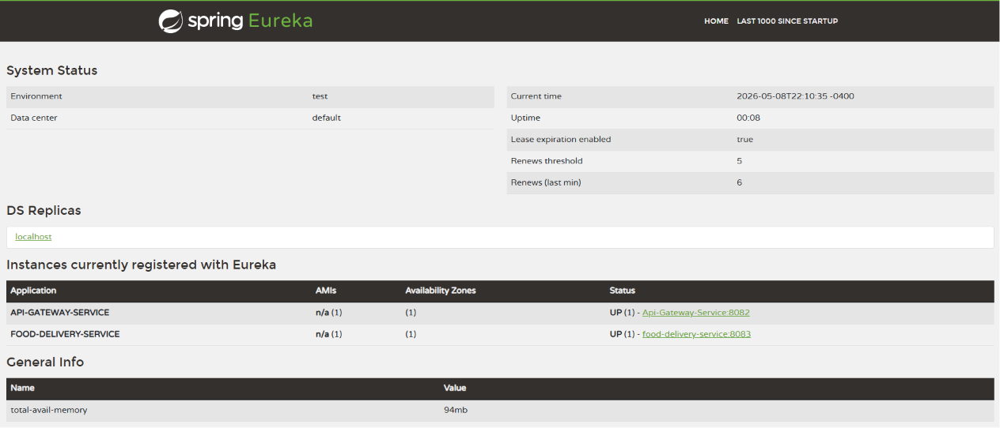

---

### React Frontend - Restaurant List
<!-- Screenshot: Customer view of available restaurants -->
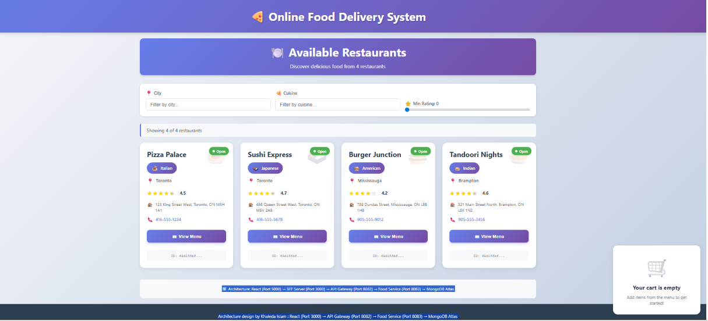

---

### React Frontend - Menu Display
<!-- Screenshot: Food items for selected restaurant -->
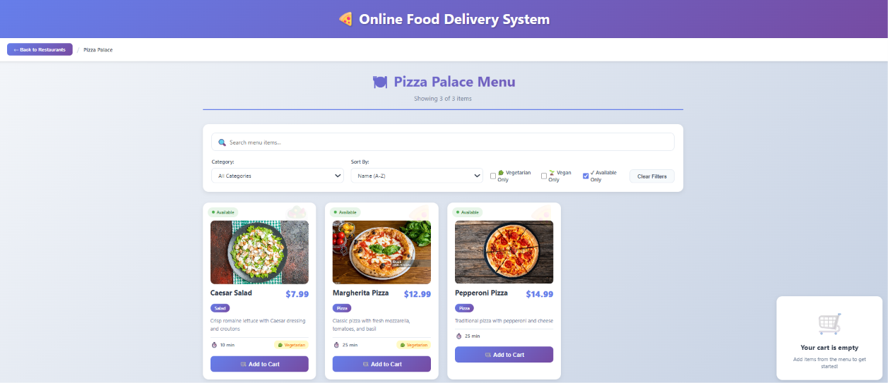

---

### React Frontend - Add to Cart
<!-- Screenshot: Adding items to shopping cart -->
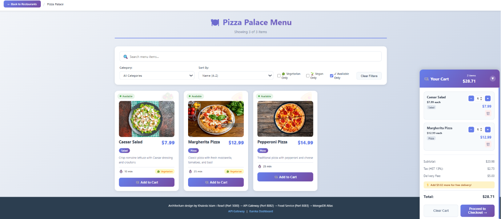

---

### React Frontend - Order Placement
<!-- Screenshot: Checkout and order placement -->
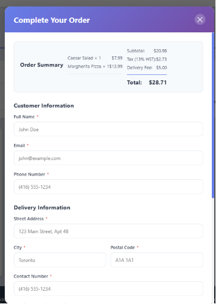

---

### React Frontend - Order Confirmation
<!-- Screenshot: Order confirmation message -->
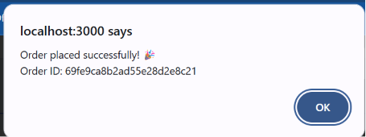

---

### Admin Panel - Dashboard
<!-- Screenshot: Admin dashboard with statistics -->
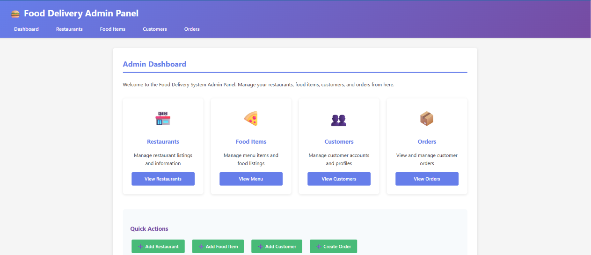

---

### Admin Panel - Restaurant Management
<!-- Screenshot: Restaurant list and CRUD operations -->
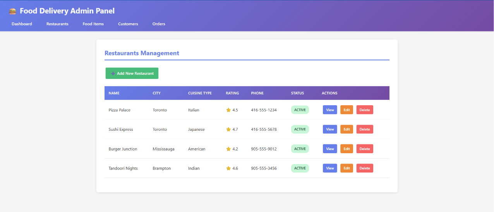

---

### Admin Panel - Restaurant Form
<!-- Screenshot: Create/Edit restaurant form -->
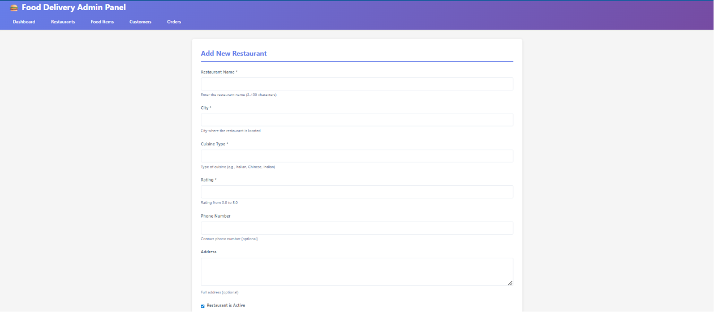

---

### Admin Panel - Food Item Management
<!-- Screenshot: Food items list -->
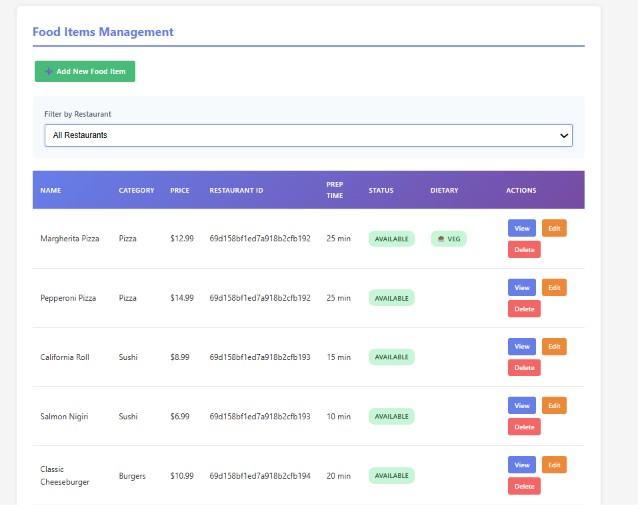

---

### Admin Panel - Food Item Form
<!-- Screenshot: Create/Edit food item form -->
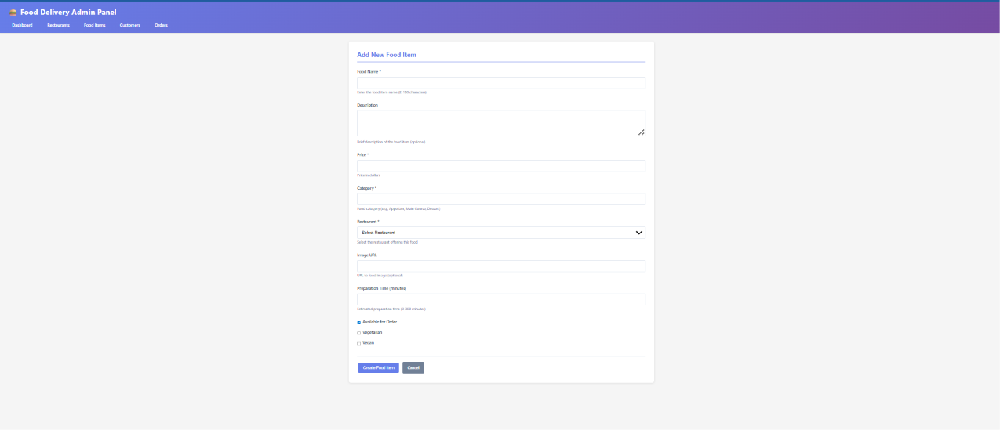

---

### Admin Panel - Customer Management
<!-- Screenshot: Customer list -->
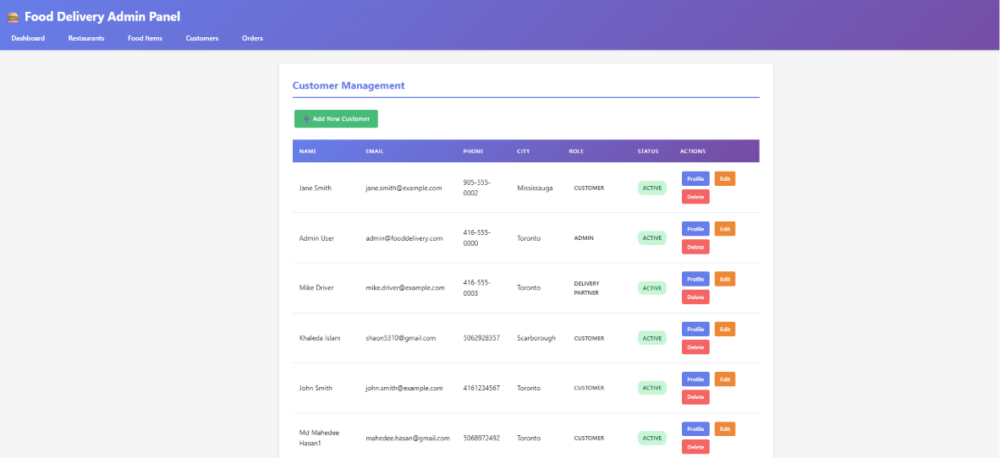

---

### Admin Panel - Customer Form
<!-- Screenshot: Customer details form -->
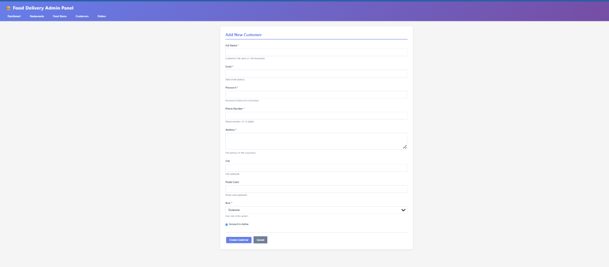

---

### Admin Panel - Order Management
<!-- Screenshot: Order search and list -->
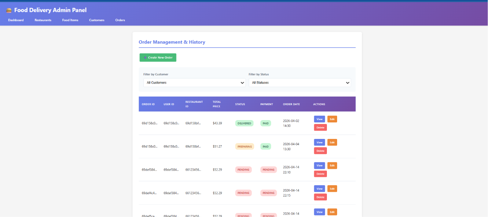

---

### Admin Panel - Order Details
<!-- Screenshot: Order details and status update -->
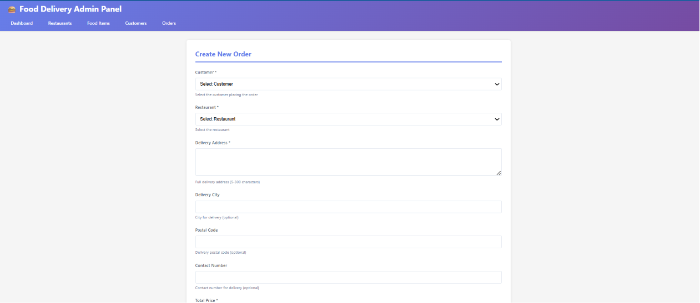

---

## Project Structure

```
fds/
├── doc/
│   ├── ARCHITECTURE-DESIGN-DOCUMENT.md  # Comprehensive architecture guide
│   ├── online-food-delivery-system-requirements.md
│   ├── Requirement.pdf
│   └── screen-shot/                      # Application screenshots
└── src/
    ├── docker-compose.yml                # Docker orchestration
    ├── DOCKER-README.md
    ├── eureka-server/
    │   ├── src/main/
    │   │   ├── java/com/fooddelivery/
    │   │   │   └── EurekaServerApplication.java
    │   │   └── resources/
    │   │       └── application.properties
    │   └── pom.xml
    ├── api-gateway-service/
    │   ├── src/main/
    │   │   ├── java/com/fooddelivery/
    │   │   │   ├── ApiGatewayServiceApplication.java
    │   │   │   ├── config/
    │   │   │   │   └── WebClientConfig.java
    │   │   │   ├── controller/
    │   │   │   │   ├── RestaurantController.java
    │   │   │   │   ├── FoodController.java
    │   │   │   │   ├── UserController.java
    │   │   │   │   └── OrderController.java
    │   │   │   └── service/
    │   │   │       ├── RestaurantClientService.java
    │   │   │       ├── FoodClientService.java
    │   │   │       ├── UserClientService.java
    │   │   │       └── OrderClientService.java
    │   │   └── resources/
    │   │       └── application.properties
    │   └── pom.xml
    ├── food-delivery-service/
    │   ├── src/main/
    │   │   ├── java/com/fooddelivery/
    │   │   │   ├── FoodDeliveryServiceApplication.java
    │   │   │   ├── controller/
    │   │   │   │   ├── RestaurantController.java
    │   │   │   │   ├── FoodController.java
    │   │   │   │   ├── UserController.java
    │   │   │   │   ├── OrderController.java
    │   │   │   │   └── admin/
    │   │   │   │       ├── AdminRestaurantController.java
    │   │   │   │       ├── AdminFoodController.java
    │   │   │   │       ├── AdminUserController.java
    │   │   │   │       └── AdminOrderController.java
    │   │   │   ├── dto/
    │   │   │   │   ├── GuestCheckoutRequest.java
    │   │   │   │   └── OrderRequest.java
    │   │   │   ├── model/
    │   │   │   │   ├── Restaurant.java
    │   │   │   │   ├── Food.java
    │   │   │   │   ├── User.java
    │   │   │   │   └── Order.java
    │   │   │   ├── repository/
    │   │   │   │   ├── RestaurantRepository.java
    │   │   │   │   ├── FoodRepository.java
    │   │   │   │   ├── UserRepository.java
    │   │   │   │   └── OrderRepository.java
    │   │   │   ├── service/
    │   │   │   │   ├── RestaurantService.java
    │   │   │   │   ├── FoodService.java
    │   │   │   │   ├── UserService.java
    │   │   │   │   └── OrderService.java
    │   │   │   └── config/
    │   │   │       └── MongoConfig.java
    │   │   └── resources/
    │   │       ├── application.properties
    │   │       ├── static/css/
    │   │       │   └── admin-style.css
    │   │       └── templates/
    │   │           ├── admin/
    │   │           │   ├── dashboard.html
    │   │           │   ├── restaurants.html
    │   │           │   ├── restaurant-form.html
    │   │           │   ├── foods.html
    │   │           │   ├── food-form.html
    │   │           │   ├── customers.html
    │   │           │   ├── customer-form.html
    │   │           │   ├── orders.html
    │   │           │   └── order-form.html
    │   │           └── fragments/
    │   │               └── layout.html
    │   └── pom.xml
    └── react-frontend/
        ├── public/
        │   ├── index.html
        │   ├── manifest.json
        │   └── images/food/
        ├── src/
        │   ├── App.js
        │   ├── App.css
        │   ├── index.js
        │   ├── components/
        │   │   ├── RestaurantList.js
        │   │   ├── RestaurantCard.js
        │   │   ├── MenuDisplay.js
        │   │   ├── FoodItem.js
        │   │   ├── Cart.js
        │   │   ├── OrderForm.js
        │   │   └── OrderHistory.js
        │   ├── context/
        │   │   └── CartContext.js
        │   └── services/
        │       ├── restaurantService.js
        │       ├── foodService.js
        │       ├── userService.js
        │       └── orderService.js
        └── package.json
```

---

## Prerequisites

- **Java** 21 or higher
- **Maven** 3.9 or higher
- **Node.js** 16+ and NPM 8+
- **MongoDB Atlas Account** (Free tier available)
- **Git** (for cloning the repository)

---

## Setup and Running

### 1. Clone the Repository

```bash
git clone https://github.com/yourusername/fds.git
cd fds/src
```

### 2. MongoDB Atlas Setup

1. Create a free MongoDB Atlas account at https://www.mongodb.com/cloud/atlas
2. Create a new cluster
3. Create a database user with username and password
4. Whitelist your IP address (or 0.0.0.0/0 for development)
5. Get your connection string

### 3. Configure Food Delivery Service

Edit `src/food-delivery-service/src/main/resources/application.properties`:

```properties
# MongoDB Atlas Connection
spring.data.mongodb.uri=mongodb+srv://<username>:<password>@<cluster>.mongodb.net/foodDeliveryDB?retryWrites=true&w=majority
spring.data.mongodb.database=foodDeliveryDB
spring.data.mongodb.auto-index-creation=true

# Server Configuration
server.port=8083

# Reactive Configuration
spring.main.web-application-type=reactive

# Eureka Client Configuration
eureka.client.serviceUrl.defaultZone=http://localhost:8761/eureka/
spring.application.name=food-delivery-service
eureka.instance.prefer-ip-address=true
eureka.instance.hostname=localhost
```

### 4. Start All Services

#### Option 1: Using Maven Wrapper (Recommended)

**Terminal 1 - Start Eureka Server:**
```bash
cd src/eureka-server
./mvnw.cmd spring-boot:run    # Windows
./mvnw spring-boot:run         # Linux/Mac
```

**Terminal 2 - Start Food Delivery Service:**
```bash
cd src/food-delivery-service
./mvnw.cmd spring-boot:run    # Windows
./mvnw spring-boot:run         # Linux/Mac
```

**Terminal 3 - Start API Gateway:**
```bash
cd src/api-gateway-service
./mvnw.cmd spring-boot:run    # Windows
./mvnw spring-boot:run         # Linux/Mac
```

**Terminal 4 - Start React Frontend:**
```bash
cd src/react-frontend
npm install                    # First time only
npm start
```

#### Option 2: Using Docker Compose

```bash
cd src
docker-compose up --build
```

---

## Access the Application

### Customer Interface
Open your browser and navigate to:
```
http://localhost:3000
```

### Admin Panel (Thymeleaf)
Direct access to admin interface:
```
http://localhost:8083/admin
```

### Eureka Dashboard
Monitor service health and registration:
```
http://localhost:8761
```

### API Gateway
RESTful API endpoint:
```
http://localhost:8082/api
```

---

## Application URLs

| Service | URL | Purpose |
|---------|-----|---------|
| **React Frontend** | http://localhost:3000 | Customer interface |
| **API Gateway** | http://localhost:8082 | REST API entry point |
| **Food Delivery Service (API)** | http://localhost:8083/api | Direct REST API access |
| **Food Delivery Service (Admin)** | http://localhost:8083/admin | Admin management panel |
| **Eureka Dashboard** | http://localhost:8761 | Service registry |

---

## REST API Endpoints

Base URL: `http://localhost:8082/api`

### Restaurants
| Method | Endpoint | Description |
|--------|----------|-------------|
| GET | `/restaurants` | Get all restaurants |
| GET | `/restaurants/{id}` | Get restaurant by ID |
| POST | `/restaurants` | Create new restaurant |
| PUT | `/restaurants/{id}` | Update restaurant |
| DELETE | `/restaurants/{id}` | Delete restaurant |

### Foods
| Method | Endpoint | Description |
|--------|----------|-------------|
| GET | `/foods` | Get all food items |
| GET | `/foods/{id}` | Get food item by ID |
| GET | `/foods/restaurant/{restaurantId}` | Get menu by restaurant |
| POST | `/foods` | Create new food item |
| PUT | `/foods/{id}` | Update food item |
| DELETE | `/foods/{id}` | Delete food item |

### Users
| Method | Endpoint | Description |
|--------|----------|-------------|
| GET | `/users` | Get all users |
| GET | `/users/{id}` | Get user by ID |
| POST | `/users/register` | Register new user |
| PUT | `/users/{id}` | Update user profile |
| DELETE | `/users/{id}` | Delete user |

### Orders
| Method | Endpoint | Description |
|--------|----------|-------------|
| GET | `/orders` | Get all orders |
| GET | `/orders/{id}` | Get order by ID |
| GET | `/orders/user/{userId}` | Get user's order history |
| POST | `/orders` | Place new order |
| PUT | `/orders/{id}/status` | Update order status |
| DELETE | `/orders/{id}` | Cancel order |

---

## Database Schema (MongoDB Collections)

### restaurants
```json
{
  "id": "ObjectId",
  "name": "String",
  "address": "String",
  "city": "String",
  "cuisineType": "String",
  "rating": "Double",
  "contactNumber": "String"
}
```

### foods
```json
{
  "id": "ObjectId",
  "name": "String",
  "description": "String",
  "price": "Double",
  "category": "String",
  "restaurantId": "String",
  "imageUrl": "String",
  "available": "Boolean"
}
```

### users
```json
{
  "id": "ObjectId",
  "firstName": "String",
  "lastName": "String",
  "email": "String",
  "phone": "String",
  "address": "String",
  "city": "String",
  "postalCode": "String"
}
```

### orders
```json
{
  "id": "ObjectId",
  "userId": "String",
  "items": [
    {
      "foodId": "String",
      "foodName": "String",
      "quantity": "Integer",
      "price": "Double"
    }
  ],
  "totalPrice": "Double",
  "deliveryAddress": "String",
  "status": "String",
  "orderDate": "Date",
  "restaurantId": "String"
}
```

---

## Application Workflow

### Customer Order Flow
1. Browse available restaurants on React frontend
2. Select restaurant to view menu
3. Add food items to cart with quantities
4. Proceed to checkout
5. Enter delivery address and customer details
6. Place order
7. Receive order confirmation
8. View order in order history

### Admin Management Flow
1. Access admin panel at http://localhost:8083/admin
2. View dashboard with statistics
3. Manage restaurants (Create/Update/Delete)
4. Manage food items for each restaurant
5. View and manage customer accounts
6. Search and view orders
7. Update order status (Pending → Confirmed → Delivered)

### Microservice Communication Flow
1. **React Frontend** makes HTTP request to `http://localhost:8082/api/restaurants`
2. **API Gateway** receives request at `RestaurantController`
3. **API Gateway** queries **Eureka** to resolve `food-delivery-service`
4. **API Gateway** uses **WebClient** with `@LoadBalanced` to call backend
5. **Food Delivery Service** processes request and queries **MongoDB Atlas**
6. **MongoDB Atlas** returns data to **Food Delivery Service**
7. **Food Delivery Service** sends JSON response back to **API Gateway**
8. **API Gateway** forwards response to **React Frontend**
9. **React** renders data in UI

---

## Key Features Explained

### Reactive Programming
- Uses **Project Reactor** (Mono/Flux) for non-blocking operations
- All database operations are reactive with `ReactiveMongoRepository`
- WebClient for reactive HTTP calls between microservices
- Better scalability and resource utilization

### Service Discovery
- **Eureka Server** maintains registry of all microservices
- Services automatically register on startup
- API Gateway discovers Food Delivery Service dynamically
- No hardcoded IP addresses needed
- Health monitoring with heartbeat mechanism

### Dual Interface Architecture
Food Delivery Service provides **two interfaces**:
1. **REST API** (`/api/*`) - For React frontend and programmatic access
2. **Thymeleaf Admin Panel** (`/admin/*`) - For direct admin management

This allows:
- ✅ Standalone operation for admin tasks
- ✅ Microservice operation for customer frontend
- ✅ Direct database management without API Gateway

### Load Balancing
```java
@Bean
@LoadBalanced
public WebClient.Builder loadBalancedWebClientBuilder() {
    return WebClient.builder();
}
```
- Client-side load balancing with Spring Cloud LoadBalancer
- Automatic failover if service instances fail
- Round-robin distribution of requests

---

## Business Rules

### Order Status Lifecycle
```
PENDING → CONFIRMED → PREPARING → OUT_FOR_DELIVERY → DELIVERED
                   ↓
                CANCELLED
```

### Price Calculation
```
Order Total = Σ(Food Item Price × Quantity) for all items in cart
```

Example:
- Pizza: $15.99 × 2 = $31.98
- Burger: $8.99 × 1 = $8.99
- **Total: $40.97**

### Guest Checkout
- Customers can order without registration
- Provide delivery details at checkout
- Order is still tracked in system
- Optional user account creation for order history

---

## Technology Deep Dive

### Spring WebFlux (Reactive Stack)
- **Non-blocking I/O** with Netty server
- **Backpressure** handling for stream processing
- **Mono<T>** for single result operations
- **Flux<T>** for multiple result streams

Example:
```java
@GetMapping
public Flux<Restaurant> getAllRestaurants() {
    return restaurantRepository.findAll();
}
```

### Spring Cloud Netflix Eureka
- **Service Registry** for microservice discovery
- **Client-side service discovery** pattern
- **Health checks** with configurable intervals
- **Self-preservation mode** to prevent mass de-registration

### MongoDB Atlas
- **Cloud-hosted** MongoDB database
- **Automatic scaling** and backups
- **Multi-region** deployment support
- **Built-in monitoring** and alerts

---

## Development Notes


### Assessment Focus
- Microservice development with Spring Boot
- REST API with Reactor API and Spring WebFlux
- MongoDB integration with reactive repositories
- React frontend consuming REST services
- Spring Cloud implementation (Eureka, API Gateway)
- Service communication and discovery


---

## Docker Deployment

### Build and Run with Docker Compose

```bash
cd src
docker-compose up --build
```

This will start:
- Eureka Server (8761)
- Food Delivery Service (8083)
- API Gateway (8082)
- React Frontend (3000)

### Individual Docker Commands

```bash
# Build Eureka Server
cd eureka-server
docker build -t eureka-server .
docker run -p 8761:8761 eureka-server

# Build Food Delivery Service
cd food-delivery-service
docker build -t food-delivery-service .
docker run -p 8083:8083 food-delivery-service

# Build API Gateway
cd api-gateway-service
docker build -t api-gateway-service .
docker run -p 8082:8082 api-gateway-service

# Build React Frontend
cd react-frontend
docker build -t react-frontend .
docker run -p 3000:3000 react-frontend
```

---

## Testing the Application

### Manual Testing Steps

1. **Verify Eureka Dashboard**
   - Navigate to http://localhost:8761
   - Confirm both services are registered (status: UP)

2. **Test Admin Panel**
   - Go to http://localhost:8083/admin
   - Create test restaurant
   - Add food items to restaurant
   - Verify data is saved

3. **Test React Frontend**
   - Go to http://localhost:3000
   - Browse restaurants
   - Add items to cart
   - Complete checkout
   - Verify order in admin panel

4. **Test API Endpoints**
   ```bash
   # Get all restaurants
   curl http://localhost:8082/api/restaurants
   
   # Get restaurant by ID
   curl http://localhost:8082/api/restaurants/{id}
   
   # Create new restaurant (POST)
   curl -X POST http://localhost:8082/api/restaurants \
     -H "Content-Type: application/json" \
     -d '{"name":"Test Restaurant","city":"Toronto","cuisineType":"Italian"}'
   ```

---


## Quick Start Commands

```bash
# Clone repository
git clone https://github.com/yourusername/fds.git
cd fds/src

# Terminal 1 - Eureka Server
cd eureka-server
./mvnw.cmd spring-boot:run

# Terminal 2 - Food Delivery Service
cd food-delivery-service
./mvnw.cmd spring-boot:run

# Terminal 3 - API Gateway
cd api-gateway-service
./mvnw.cmd spring-boot:run

# Terminal 4 - React Frontend
cd react-frontend
npm install
npm start

# Access application
# React: http://localhost:3000
# Admin: http://localhost:8083/admin
# Eureka: http://localhost:8761
```

---

**Built with ❤️ using Spring Boot, Spring Cloud, React, MongoDB, Euraka Discovery Server**
